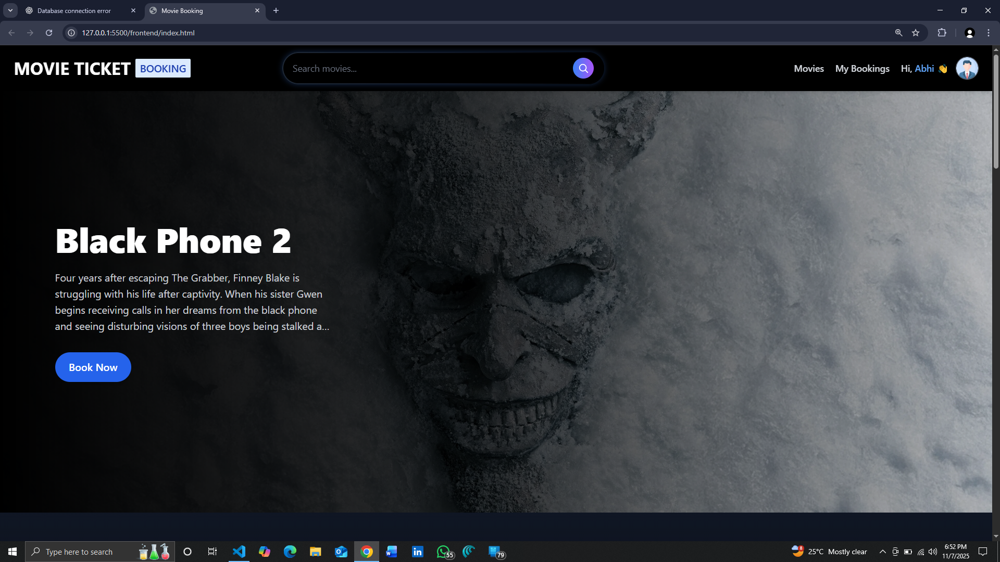
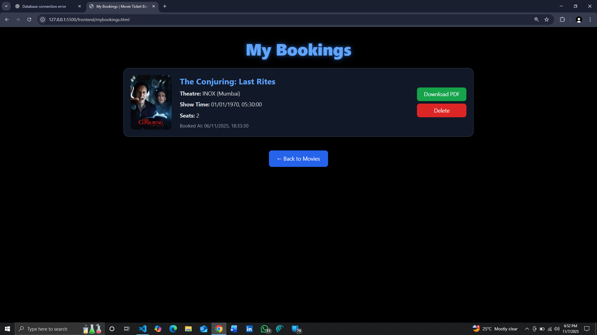
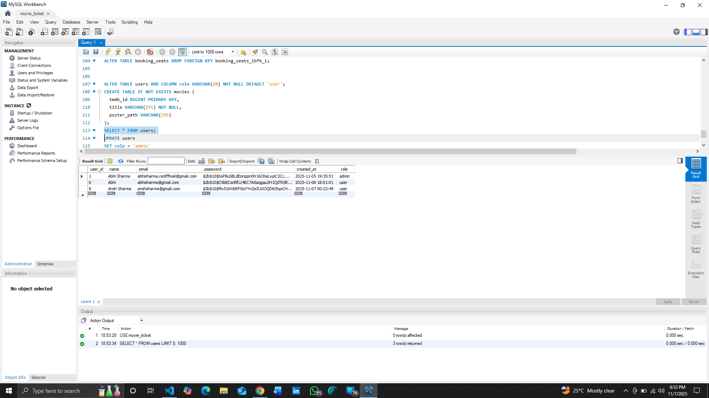
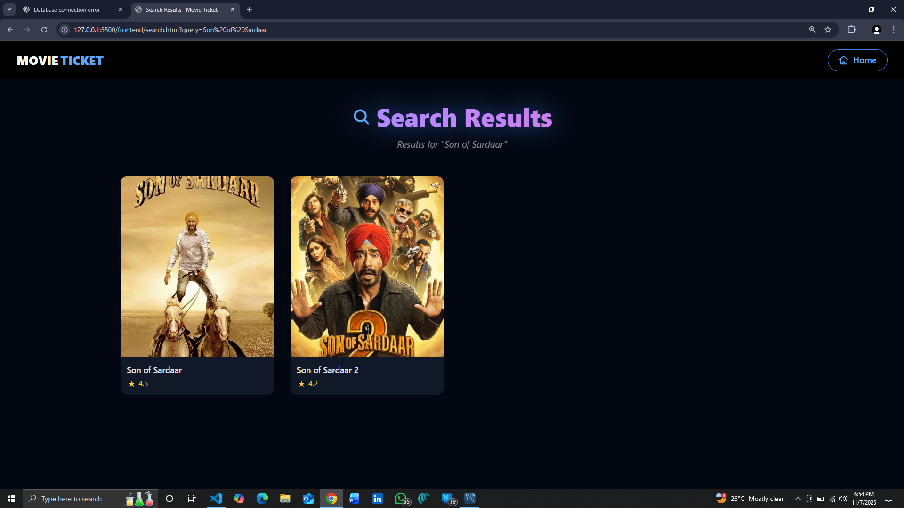
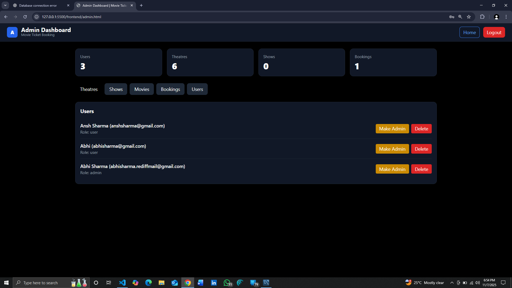
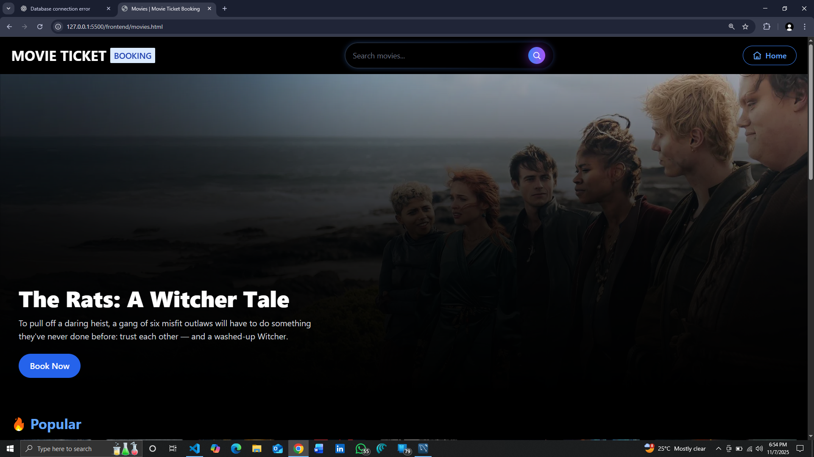
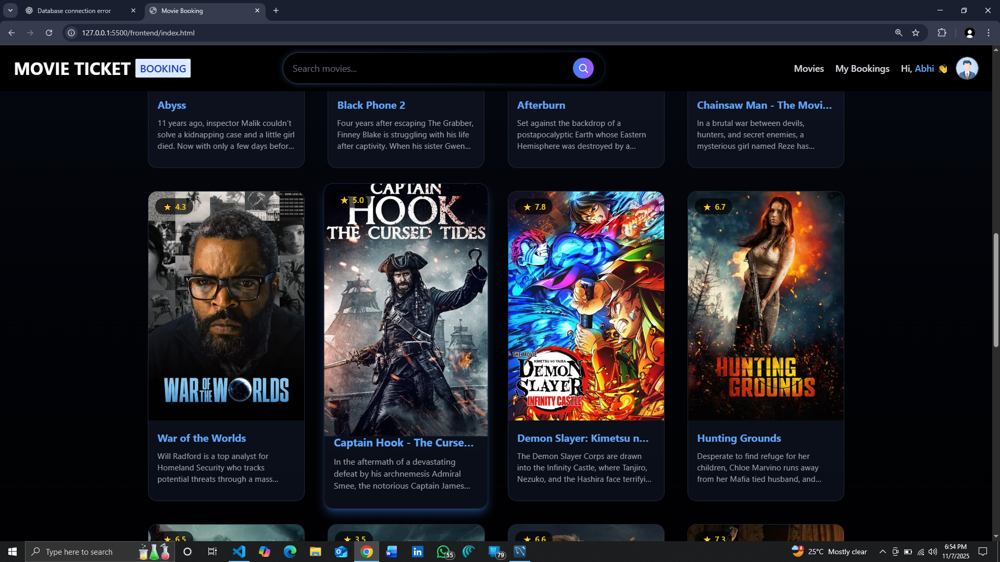
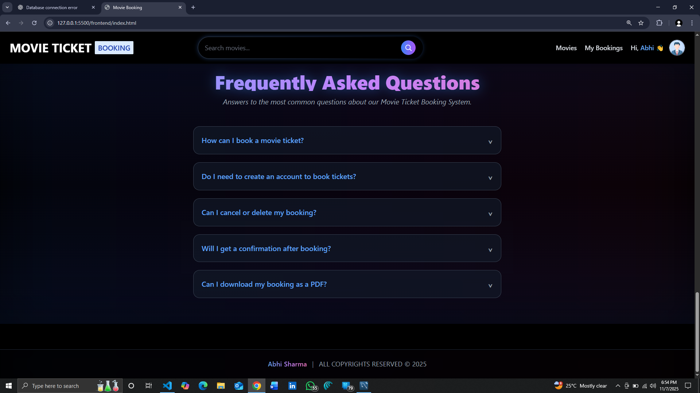

# 🎬 Movie Ticket Booking System

A full‑stack movie ticket booking web app built with **Node.js + Express**, **MySQL**, and **Vanilla JS**.

---

## ✨ Features
- User registration & login (JWT)
- Browse movies, search, view details
- Choose theatre, show time & seats; book tickets
- View bookings and download ticket as PDF
- Admin dashboard (users, theatres, shows, movies)

---

## 🧠 Tech
**Frontend:** HTML, CSS, JavaScript  
**Backend:** Node.js, Express, JWT, bcrypt  
**DB:** MySQL (local)  
**Env:** dotenv, CORS

---

## ⚙️ Local Setup (Step‑by‑Step)

> Make sure **MySQL Server** and **Node.js** are installed.

### 1) Clone & enter backend
```bash
git clone https://github.com/<your-username>/<your-repo>.git
cd <your-repo>/backend
```

### 2) Initialize & install packages
```bash
npm init -y
npm install express mysql2 bcrypt dotenv jsonwebtoken cors
```

### 3) Create `.env`
Create a file `backend/.env` with your local DB credentials:
```env
DB_HOST=127.0.0.1
DB_USER=root
DB_PASSWORD=your_mysql_password
DB_NAME=movie_ticket
PORT=3000
JWT_SECRET=your_jwt_secret_key

```

### 4) Create the database
Open **MySQL Workbench** (or CLI) and run:
```sql
CREATE DATABASE IF NOT EXISTS movie_ticket;
```

> (Create tables via your SQL scripts or on first run.)

### 5) Start the backend
```bash
npm start
```
Server will start on `http://localhost:3000`.

### 6) Open the frontend
Open `frontend/index.html` (or use VS Code **Live Server**).

---

## 📸 Screenshots (Flow)

**Home page (Hero banner)**



**My Bookings page**



**MySQL Workbench (users table)**



**Movie details modal**


**Search results**



**Admin dashboard**



**Movies grid listing**



**Movies page (alternate view)**



**FAQ section**



---

## 📝 Notes
- This project runs with a **local MySQL** instance (no free MySQL hosting used).
- For a temporary online demo, you can expose local DB using **ngrok** or host DB on **Planetscale/Render**.

## 👤 Author
**Abhi Sharma** — abhisharma.rediffmail@gmail.com
